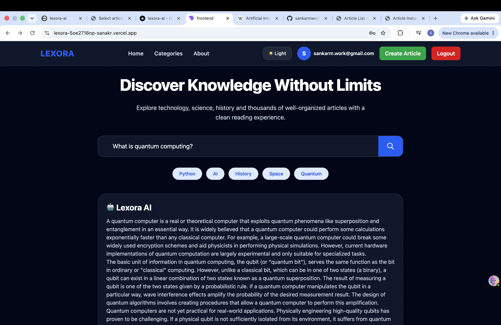
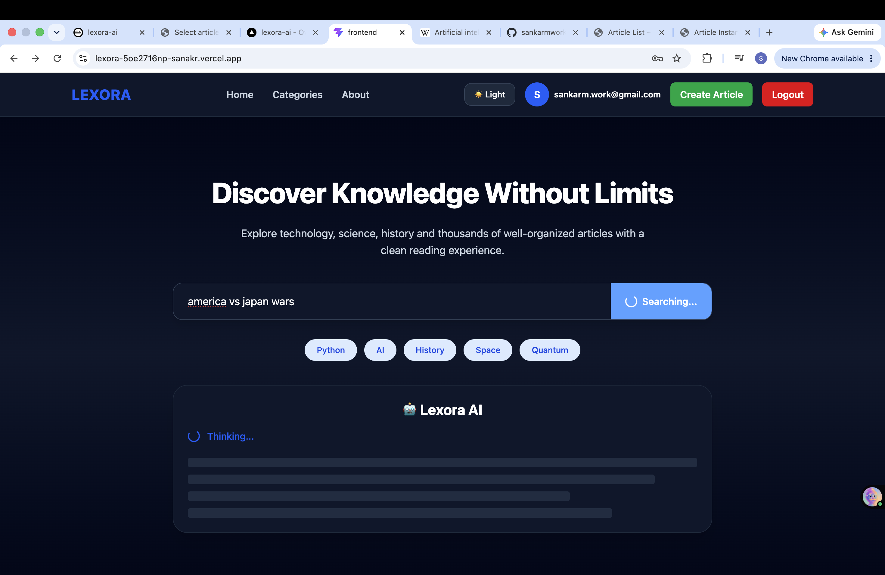
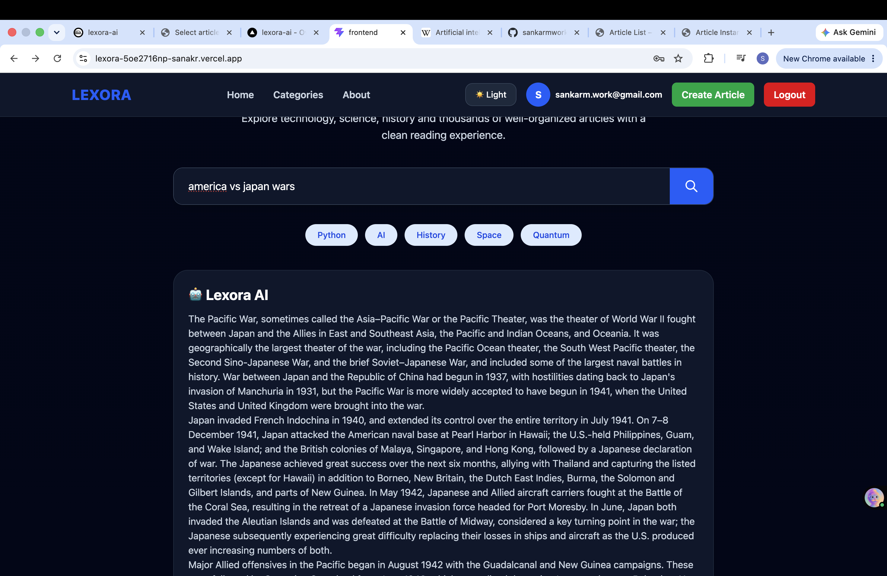

# 🚀 Lexora AI – AI-Powered Knowledge Platform

Lexora AI is a full-stack AI-powered knowledge platform inspired by Wikipedia. It combines React, Django REST Framework, Gemini AI, and Retrieval-Augmented Generation (RAG) with ChromaDB to provide intelligent knowledge search and article generation.

## ✨ Features

- 🔐 JWT Authentication
- 🤖 Gemini AI article generation
- 🧠 RAG using ChromaDB
- 📚 Wikipedia article import
- 🖼️ Automatic Wikipedia image retrieval
- 🔍 AI-powered semantic search
- 📝 Create, edit and manage articles
- 📂 Categories, bookmarks and comments
- 🌙 Light/Dark mode
- 📱 Responsive UI

## 🛠️ Tech Stack

- React.js
- Django REST Framework
- Python
- PostgreSQL
- Gemini AI
- ChromaDB
- JWT Authentication
- Tailwind CSS
- Railway
- Vercel
- Docker

## 📸 Screenshots

### Home (Dark Mode)


### Home (Light Mode)


### Create Article


### AI Search


### AI Search Loading


### AI Search Result


## 🚀 Installation

```bash
git clone https://github.com/sankarmwork-afk/lexora-ai.git
cd lexora-ai
```

Start the backend and frontend following your project setup.

## 🌐 Live Demo

Frontend: https://lexora-ai-eight.vercel.app

## 👨‍💻 Author

Sankar